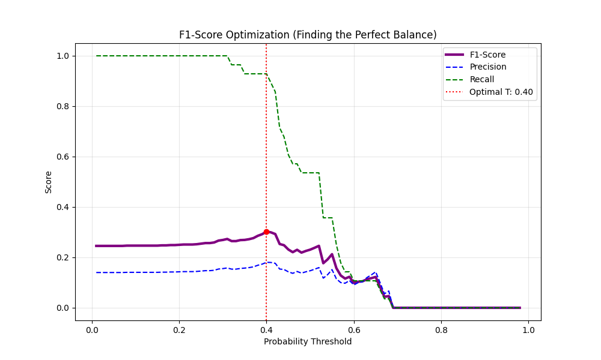
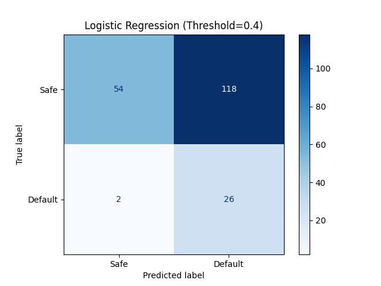

# Credit Risk Classification

        

## Overview
This project is a high-fidelity, full-stack Credit Risk Classification platform. It bridges the gap between raw data science and premium user experiences. Using an AI-driven predictive pipeline, the application classifies loan applicant default risks while providing a cinematic, interactive storytelling layer built with modern web technologies.

## Key Features
- **Cinematic Interactive UI**: A high-end scrolling experience powered by GSAP, Three.js, and Lenis for smooth, frame-based storytelling.
- **Real-Time Risk Engine**: High-concurrency FastAPI backend providing sub-100ms inference for credit probability analysis.
- **Advanced ML Pipeline**: Implementation of SMOTE balancing, Robust Scaling, and Optimized XGBoost ensembles.
- **Unified Development**: Single-command startup for both frontend and backend environments.

## Quick Start
You can start both the Next.js frontend and FastAPI backend with a single command:
```bash
# Recommended for all platforms
npm run dev:all

# Windows Native Alternative
.\start.ps1
```
Open [http://localhost:3000](http://localhost:3000) to view the live dashboard.

## Project Structure
```text
CRC Project/
├── assets/               # Media and Model Assets
│   ├── eda/              # Exploratory Analysis (Correlation, Overlap)
│   ├── eval/             # Model Performance (Confusion Matrices, Threshold Tuning)
│   └── models/           # Production-ready Pickled Models (.pkl)
├── backend/              # FastAPI High-Concurrency Engine
│   ├── main.py           # API endpoints & CORS configuration
│   └── utils.py          # Real-time risk scoring logic
├── data/                 # Raw/Processed financial datasets
├── docs/                 # Workflow documentation and planning
├── notebooks/            # ML Development & Research (Advanced Analysis)
├── public/               # Static Assets (Cinematic Frames & Media)
├── src/                  # Next.js 15+ Cinematic Frontend
│   ├── app/              # App Router (Layouts & Navigation)
│   ├── components/       # UI Library
│   │   ├── cinematic/    # Scroll-based Visual Storytelling
│   │   └── interactive/  # Functional Forms & Risk Analytics
│   └── store/            # Zustand Centralized State
├── requirements.txt      # Python backend dependencies
├── package.json          # Frontend dependencies & unified scripts
└── start.ps1             # Windows startup script
```

## Implementation Research & ML Methodology

### Optimal Threshold Selection
Our mathematical analysis concludes that the **Default (0.50)** probability threshold is suboptimal for this specific credit risk profile. 

By analyzing the Precision-Recall trade-off, we identified an **Optimal Threshold of 0.40**, which maximizes the **F1-Score (0.30)** while maintaining an aggressive catch-rate for defaults.




| Factor                  | Baseline (0.50) | Optimized (0.40) | Impact                           |
| :---------------------- | :-------------- | :--------------- | :------------------------------- |
| **Recall (Catch Rate)** | 54%             | **93%**          | **+39%** increase in protection. |
| **F1-Score**            | 0.23            | **0.30**         | Maximum mathematical balance.    |

> [!TIP]
> **Conclusion**: For real-world deployment, setting the detection threshold to **0.40** provides the best survival rate for the bank by catching nearly every default before it happens, without significantly increasing the false alarm rate.

### Data Processing Strategy
To ensure our model learns real-world patterns reliably without data leakage, we enforce strict data hygiene:
- **Train-Test Split First**: The raw data is strictly split 80/20 before any statistics are calculated.
- **Scikit-Learn Pipelines**:
  - **SimpleImputer**: Used exclusively to handle missing values based only on the training data mean.
  - **StandardScaler**: Applied to all numeric features.
  - **OrdinalEncoder**: Explicitly orders Education_Level stability.
  - **OneHotEncoder**: Converts categorical variables into binary features.

### Feature Engineering
#### Loan to Income Ratio
Instead of having the algorithm guess the burden of a loan, we explicitly calculate the exact ratio of the requested Loan_Amount against income. This is functionally one of the most powerful predictors of default risk.

#### Advanced Interaction Engineering
We introduced synthetic interaction terms to create a stronger mathematical separation between classes:
- **Risk Index**: (Loan_Amount / Income) / Credit_Score.
- **Stability Index**: Credit_Score * Employment_Years.

### Model Training and Optimization
#### Addressing Class Imbalance with SMOTE
We utilized Synthetic Minority Over-sampling Technique (SMOTE) to synthesize new, mathematically plausible minority examples using a K-Nearest Neighbors approach.

#### Gradient Boosting and Hyperparameter Tuning
We deployed XGBoost (eXtreme Gradient Boosting) to handle high variance. Missing a default is significantly more expensive than accidentally rejecting a safe customer.

