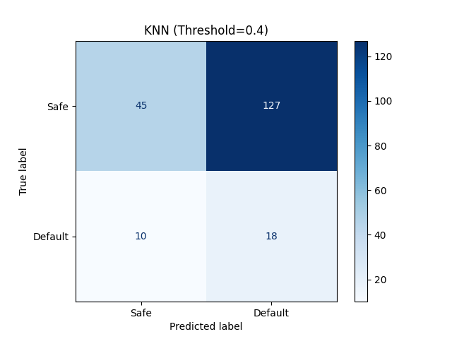
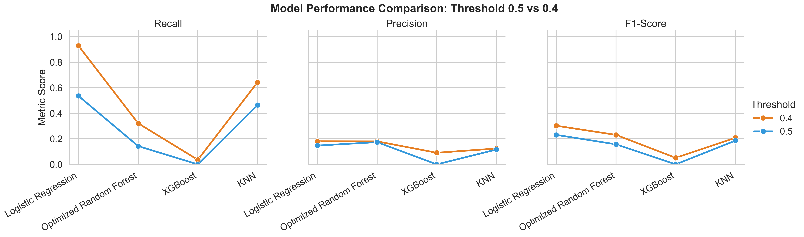

# Understanding the Credit Risk Pipeline: A Comprehensive Deep Dive

Welcome, student! This guide is designed to take you from a raw dataset to a production-ready risk model. We will explore the code, the math, and the "ML-first" logic behind every decision.

---

## The ML Systems Architecture: The Foundation

Before training our first model, we designed a system architecture that prioritizes **inference reliability** and **data integrity**.

### 1. The Intelligence Engine
*   **FastAPI (Inference Server)**: We chose FastAPI for its asynchronous capabilities and native Pydantic support. This allows our Scikit-Learn models to serve predictions with sub-100ms latency while validating every single incoming feature against our schema.
*   **Scikit-Learn Ecosystem**: While deep learning is popular, credit risk relies on **explainability**. Scikit-Learn provides the transparent mathematics required for financial auditing and risk modeling.
*   **Joblib Serialization**: We use versioned joblib artifacts to ensure that the exact preprocessing transformers used during training are the ones used during live inference, preventing "training-serving skew."

### 2. The Data Contract (Pydantic)
To prevent "Garbage In, Garbage Out," we implemented a strict **Data Contract**. Every API request is parsed through a Pydantic model that enforces:
*   Reasonable ranges (e.g., `Income` must be positive).
*   Correct types (e.g., `Credit_Score` as an integer).
*   Required features (Ensuring no missing data reaches the brain).

---

## The ML Implementation Roadmap: Step-by-Step

Building a professional ML system follows a rigorous scientific path. We don't just "write code"; we move through five distinct phases of development:

1.  **Phase I: Discovery & EDA**: Analyzing the 2016-2024 credit dataset to find "hidden" signals (see Module 1).
2.  **Phase II: Preprocessing & Pipeline Construction**: Building a leakage-safe sequence that handles scaling and imputation in a single reusable object.
3.  **Phase III: Feature Engineering**: Inventing new metrics like the **Risk Index** (Loan-to-Income / Credit Score) to amplify the model's signal.
4.  **Phase IV: Model Benchmarking & Selection**: Training four engines (Logistic Regression, Random Forest, XGBoost, KNN) and comparing them using **Confusion Matrices** rather than just Accuracy.
5.  **Phase V: Probability Calibration & Business Logic**: Prove that the optimal "Money-Saving" threshold is **0.40**, not the default 0.50.

---

## Module 1: Seeing the Signal in the Noise (EDA)
Before writing a single line of ML code, we must look at our data. We call this **Exploratory Data Analysis (EDA)**.

### The Problem: Weak Correlation
In a perfect project, `Credit_Score` might have a 0.90 correlation with `Default`. In our data, it is much lower. This tells us the model cannot rely on a single "magic feature."


### The Challenge: Data Overlap
Look at the graph below. The "Safe" (Blue) and "Default" (Red) customers are almost completely on top of each other. This is why standard models fail—the "line" between them is very blurry.


---

## Module 2: The Evolution of our Models
Every model we built went through a **4-Stage Evolution**. Understanding this journey is key to becoming a senior ML engineer.

### Stage 1: The Baseline (Standard Prediction)
*   **The Trap**: The model sees 86% of people are "Safe" and decides to guess "Safe" for everyone.
*   **Result**: High accuracy (86%), but **0% Recall**. It fails at its only job: catching defaults.

### Stage 2: SMOTE (Correcting Imbalance)
*   **What it is**: Using SMOTE to create synthetic defaults so the data is 50/50.
*   **Result**: The model "wakes up." Recall improves significantly because the loss function now values correct default predictions.

### Stage 3: Optimization & Tuning
*   **What it is**: Using `RandomizedSearchCV` to find the perfect hyperparameters (like tree depth or regularization strength).
*   **Result**: The model becomes more stable and generalized, reducing "overfitting" on the training data.

### Stage 4: Threshold Tuning (The Business Brain)
*   **The Magic Move**: Changing the classification threshold from 0.50 to **0.40**.
*   **Result**: We enable "Suspicion Mode," catching significantly more defaults (Recall ~93%) while accepting a small, controlled increase in false alarms.

---

## Module 3: Comparative Analysis (The Model Battle)

### 1. Logistic Regression (The Balanced Winner)
*   **Why it won**: By being mathematically linear, it didn't get "fooled" by the noise in our overlap plot. It drew a clean, stable line where complex models saw fake patterns.
*   **Performance**: Jumped to high recall once we applied the 0.40 threshold.

  

### 2. Random Forest (The Overthinker)
*   **Observation**: Because it is an "ensemble" of many trees, it struggled with the messy data overlap. It tried to find complex clusters where simple logic was better.

  

### 3. XGBoost (The Industry Giant)
*   **Why it was Rejected**: XGBoost is "High-Variance." On this noisy dataset, it was trying to build a complex skyscraper on a foundation of sand. It simply couldn't find the Signal as well as Logistic Regression.


### 4. K-Nearest Neighbors (The Neighbor Watch)
*   **Smoothing the Noise**: By strictly setting `n_neighbors = 21`, we force the model to look at a large group of neighbors before making a decision. This "averages out" the messy data overlap we saw in Module 1, preventing the model from being fooled by single outliers.
*   **Risk-Sensitive Tuning**: The 0.40 threshold transforms KNN from a passive observer into a cautious guardian, raising the recall from 46% to a solid **64%**.

  

### 5. Summary: The Big Picture (Comparative Visualization)
To visualize exactly how each model reacted to our threshold tuning across **Recall**, **Precision**, and **F1-Score**, we can look at this comprehensive comparison:



*   **Observation**: The massive gain in **Recall** (Safety) across all models justifies the trade-off in precision for this specific credit-risk use case.

---

## Module 4: The Production Code

### Feature Engineering: The Risk Index
```python
# Combining Burden and Reputation
X['Risk_Index'] = (X['Loan_Amount'] / X['Income']) / X['Credit_Score']
```

### The "Magic Dial" (Custom Threshold)
In a production ML system, we don't just use `predict()`. We extract probabilities:
```python
# If probability is > 0.40, raise a caution flag
probabilities = model.predict_proba(X_test)[:, 1]
is_risky = (probabilities >= 0.40).astype(int)
```

---

## Final Project Summary
If you are starting your own ML journey today:
1.  **Don't trust Accuracy**: Use the Confusion Matrix and Recall.
2.  **Start Simple**: Logistic Regression often beats complex models on noisy data.
3.  **Tune for the Business**: The goal (Financial Safety) is more important than the default 0.50 mathematical tie-break.

**Final Knowledge check**:
> Why did we save the v1 models?
> **Answer**: To prove that our v2 choices (Tuning and Thresholds) actually made the system better. Real Data Science is about scientific comparison.

**Happy Coding.**
