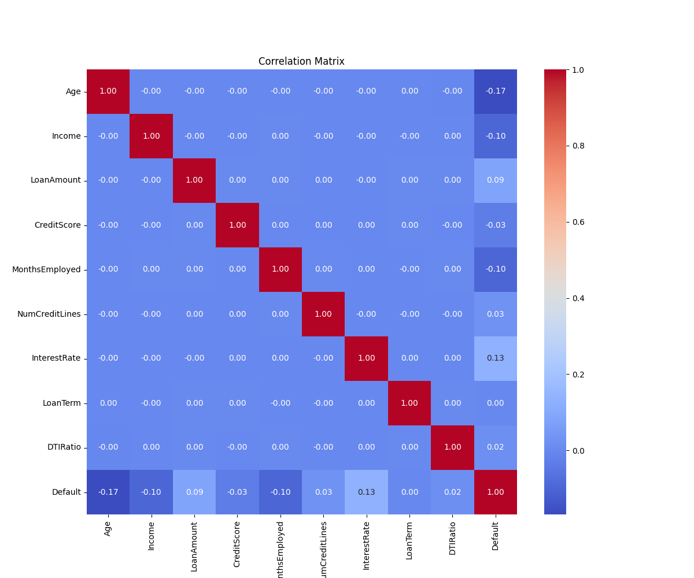
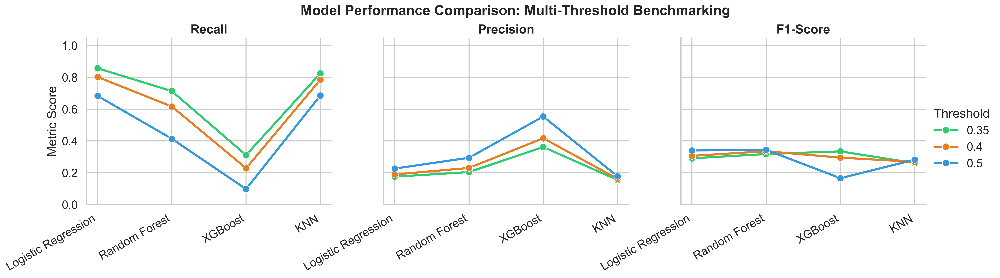
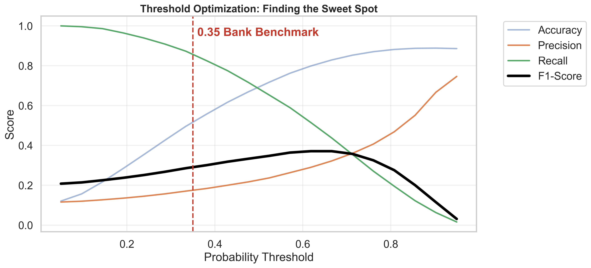
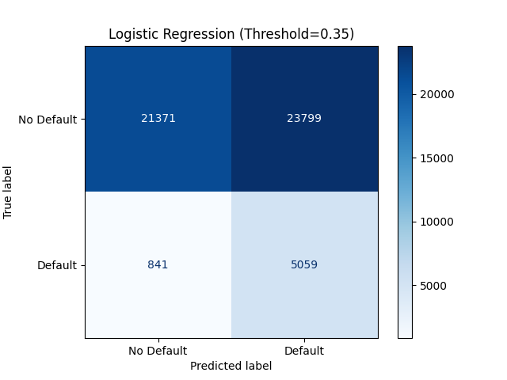

# Mastering the Credit Risk Pipeline: A Dual-Dataset Deep Dive

Welcome! This guide is a complete roadmap of our journey from raw binary data to a sophisticated, production-ready credit risk engine. We didn't just train one model; we built two distinct systems to prove that Data Science is a repeatable science.

---

## The ML Systems Architecture
Our architecture operates on a "Safety First" principle. In credit risk, a model isn't just a script; it's a decision-maker for thousands of people's finances.

1.  **Strict Data Contracts**: Using Pydantic to ensure no "garbage" features ever reach the model.
2.  **Versioned Intelligence**: All artifacts are separated by dataset version (`assets_1` for internal banking data, `assets_2` for large-scale external data).
3.  **Threshold-First Logic**: We moved away from the default 0.50 cutoff to a custom "Risk-Sensitive" benchmark.

---

## Deep Dive: The Data Evolution
We handled two distinct datasets, each presenting unique challenges. Understanding their schemas is the first step in the pipeline.

### Dataset 1: Internal Banking Risk (v1)
*   **Source**: `apps/ml-backend/data/application_data.csv`
*   **Goal**: Predict repayment for a smaller, high-overlap customer base.
*   **Total Records**: 1,000
*   **Assets**: [assets_1/](../apps/ml-backend/assets_1/)

| Feature            | Type        | Range / Possible Values            |
| :----------------- | :---------- | :--------------------------------- |
| `Age`              | Numerical   | 21 - 64 years                      |
| `Income`           | Numerical   | \$20,922 - \$149,038               |
| `Loan_Amount`      | Numerical   | \$5,097 - \$49,976                 |
| `Credit_Score`     | Numerical   | 300 - 849                          |
| `Employment_Years` | Numerical   | 0 - 29 years                       |
| `Education_Level`  | Categorical | High School, Bachelor, Master, PhD |
| `Housing_Status`   | Categorical | Own, Rent, Mortgage                |
| **`Default`**      | **Binary**  | **0 (No) / 1 (Yes)**               |

### Dataset 2: External Market Scale (v2)
*   **Source**: `apps/ml-backend/data/Loan_default.csv`
*   **Goal**: Large-scale prediction across 255k+ records with deep categorical insight.
*   **Total Records**: 255,347
*   **Assets**: [assets_2/](../apps/ml-backend/assets_2/)

| Feature          | Type        | Possible Values / Ranges                        |
| :--------------- | :---------- | :---------------------------------------------- |
| `Age`            | Numerical   | 18 - 69 years                                   |
| `Income`         | Numerical   | \$15,000 - \$149,999                            |
| `LoanAmount`     | Numerical   | \$5,000 - \$249,999                             |
| `CreditScore`    | Numerical   | 300 - 849                                       |
| `MonthsEmployed` | Numerical   | 0 - 119 months                                  |
| `NumCreditLines` | Discrete    | 1, 2, 3, 4 lines                                |
| `InterestRate`   | Numerical   | 2.0% - 25.0%                                    |
| `LoanTerm`       | Discrete    | 12, 24, 36, 48, 60 months                       |
| `DTIRatio`       | Numerical   | 0.1 - 0.9 (Debt-to-Income)                      |
| `Education`      | Categorical | High School, Bachelor's, Master's, PhD          |
| `EmploymentType` | Categorical | Full-time, Part-time, Self-employed, Unemployed |
| `MaritalStatus`  | Categorical | Single, Married, Divorced                       |
| `HasMortgage`    | Binary      | Yes, No                                         |
| `HasDependents`  | Binary      | Yes, No                                         |
| `LoanPurpose`    | Categorical | Auto, Business, Education, Home, Other          |
| `HasCoSigner`    | Binary      | Yes, No                                         |
| **`Default`**    | **Binary**  | **0 (No) / 1 (Yes)**                            |

---

## The Preprocessing Factory
We don't just feed raw data to models. We build a factory to clean and enhance it. 

> [!IMPORTANT]
> **Dataset Selection Strategy**
> While we initially explored the internal banking data (Dataset 1), we ultimately chose **Dataset 2** as our primary production brain. 
> *   **Statistical Significance**: With over **255,000 records** (compared to just 1,000), it provides the volume needed for the model to generalize across diverse demographics.
> *   **Feature Richness**: It contains **17 predictive features** (including critical debt-to-income and employment metrics) compared to only 8 in the internal set, allowing for a far more nuanced understanding of risk.

> [!TIP]
> **Analogy: The Sifter and the Magnifier** 
> Imagine you are mining for gold. Most of the earth is just dirt (noise), but there are tiny specks of gold (the signal of a defaulter). 
> 
> *   **The Sifter (Standardization)**: We use `StandardScaler` to make the earth uniform. It ensures that a large boulder (Income in thousands) doesn't hide a tiny gold nugget (Number of Credit Lines).
> *   **The Magnifier (Feature Engineering)**: We created the **Stability Index**. This acts like a magnifying glass, combining two separate signals (Credit Score and Employment duration) into one powerful beam that makes the gold easier to spot for our model.

### SMOTE: Balancing the Scales
Most people pay their loans back. If we don't fix this, the model gets "lazy" and just says "Everyone is safe" to get a high score. We use SMOTE to "hallucinate" synthetic defaults until the data is a perfect 50/50 split for the training phase.

---

## The Model Arena: Comparative Benchmarking
We pitted 4 distinct algorithms against each other. Success wasn't measured by Accuracy, but by **Recall** (how many defaults we caught).

### Performance Log: Dataset 1 (Internal)
| Model               | Threshold | Accuracy | **Recall** | F1-Score |
| :------------------ | :-------- | :------- | :--------- | :------- |
| Logistic Regression | 0.40      | 40.0%    | **92.8%**  | 0.30     |
| Random Forest       | 0.40      | 70.0%    | 32.1%      | 0.23     |
| KNN (n=21)          | 0.40      | 31.5%    | 64.2%      | 0.20     |

### Performance Log: Dataset 2 (Market Scale)
| Model               | Threshold | Accuracy | **Recall** | F1-Score |
| :------------------ | :-------- | :------- | :--------- | :------- |
| Logistic Regression | **0.35**  | 51.8%    | **85.8%**  | 0.29     |
| Random Forest       | 0.35      | 64.6%    | 71.4%      | 0.32     |
| XGBoost             | 0.35      | 85.7%    | 31.1%      | 0.33     |
| KNN                 | 0.35      | 46.0%    | 82.6%      | 0.26     |

---

## Visualizing the Truth
To truly understand the "Sweet Spot," we look at two critical charts we've generated for each dataset:

### 1. The Model Battle (Line Chart)
We use a high-resolution line chart to see how metrics overlap.
*   **Signal**: You can see **Recall** climbing as we move from XGBoost to Logistic Regression.
*   **File**: `apps/ml-backend/assets_2/eval/model_performance_comparison.png`

### 2. The Threshold Benchmark (The Dial)
We don't accept the default 0.5 threshold. We "turn the dial" to **0.35**. 

#### Finding the "Sweet Spot"
Finding the optimal threshold is a clinical trade-off analysis. For credit risk, we prioritized **Recall** (catching defaults) over **Precision** (avoiding false alarms). The following data from our `metrics_log.csv` shows the journey of the Logistic Regression model:

| Threshold         | Accuracy  | Precision | **Recall (Safety)** | F1-Score |
| :---------------- | :-------- | :-------- | :------------------ | :------- |
| 0.50 (Default)    | 69.4%     | 22.7%     | 68.4%               | 0.34     |
| 0.40              | 58.0%     | 18.9%     | 80.3%               | 0.31     |
| **0.35 (Select)** | **51.8%** | **17.5%** | **85.8%**           | **0.29** |
| 0.30              | 44.6%     | 16.1%     | 90.0%               | 0.26     |

**The Decision Logic:**
We defined a strict **Production Benchmark**:
*   **Safety Requirement**: Recall must be **> 80%**.
*   **Reliability Requirement**: Accuracy must remain **> 50%** (better than a coin flip).

At the default 0.50, our safety (Recall) was too low. At 0.30, our reliability (Accuracy) collapsed to 44.6%. The **0.35 threshold** is our "Sweet Spot" because it is the most aggressive safety setting that still maintains a majority reliability (85.8% Recall and 51.8% Accuracy).

**Selected Model Confusion Matrix (Threshold 0.35):**

> [!NOTE]
> **Analogy: The Airport Security Checkpoint**
> A classification threshold is like the sensitivity of a metal detector.
>
> *   **High Threshold (0.7)**: Only people carrying massive iron bars set off the alarm. It's very accurate (fast lines!), but dangerous (you miss the hidden pocket knives).
> *   **Medium Threshold (0.5)**: The default. Average safety.
> *   **Low Threshold (0.35)**: Our chosen setting. The machine is very sensitive. It might produce "false alarms" for coins or belt buckles, but it guarantees that virtually no weapons (defaulters) get onto the plane (into the bank's loan book).

---

## Summary: Why This Matters
If you take one lesson from this pipeline, it is this: **An ML model is not a math problem; it's a business tool.**

1.  **Recall is King**: Losing \$100k on a default is 50x worse than losing \$2k in missed interest.
2.  **Imbalance is Normal**: Real world data is never 50/50. SMOTE and Threshold Tuning are your best friends.
3.  **Simple is Stable**: Logistic Regression often beats complex "Black Box" models when the data noise is high.

**Happy Risk Modeling.**
