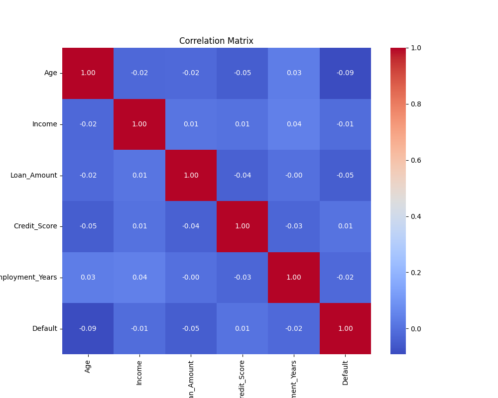
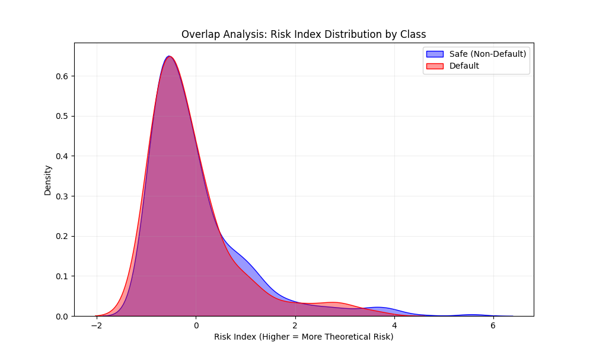
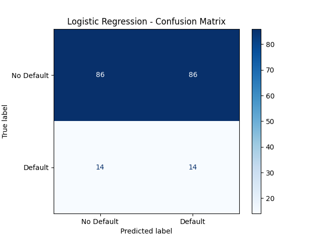
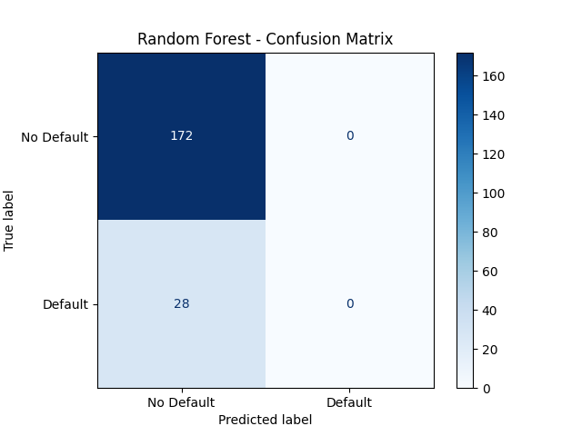
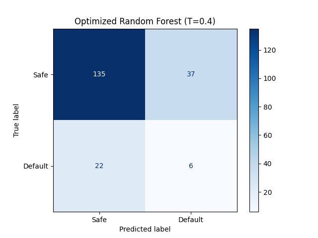

# Understanding the Credit Risk Pipeline: A Comprehensive Deep Dive

Welcome, student! This guide is designed to take you from a raw dataset to a production-ready risk model. We will explore the code, the math, and the "why" behind every decision.

---

## Module 1: Seeing the Signal in the Noise (EDA)
Before writing a single line of ML code, we must look at our data. We call this **Exploratory Data Analysis (EDA)**.

### The Problem: Weak Correlation
In a perfect project, `Credit_Score` might have a 0.90 correlation with `Default`. In our data, it is much lower. 



### The Challenge: Data Overlap
Look at the graph below. The "Safe" (Blue) and "Default" (Red) customers are almost completely on top of each other. This is why standard models fail—the "line" between them is very blurry.



---

## Module 2: The Evolution of our Models
Every model we built went through a **4-Stage Evolution**. Understanding this journey is key to becoming a senior data scientist.

### Stage 1: The Baseline (Standard Prediction)
*   **What it is**: Training a model on raw data with no special tricks.
*   **The Trap**: The model sees 86% of people are "Safe" and decides to guess "Safe" for everyone.
*   **Result**: High accuracy, but **0% Recall**. It fails at its only job: catching defaults.

### Stage 2: SMOTE (Learning to see the Minority)
*   **What it is**: Using SMOTE to create synthetic defaults so the data is 50/50.
*   **The Change**: The model now "realizes" that defaults are important. 
*   **Result**: Recall improves, but the model still makes many "educated guesses" that are wrong (low precision).

### Stage 3: Optimization (Hyperparameter Tuning)
*   **What it is**: Using `RandomizedSearchCV` to find the perfect settings (like tree depth).
*   **The Change**: We stop using "Auto" settings and force the model to search for the best mathematical structure.
*   **Result**: The model becomes more stable and reliable.

### Stage 4: Threshold Tuning (The Business Brain)
*   **What it is**: Changing the win-condition from 0.50 to **0.40**.
*   **The Change**: We enable the model's "Suspicion Mode."
*   **Result**: Dramatic jump in safety (93% of defaults caught).

---

## Module 3: Comparative Analysis (Model vs. Model)

### 1. Logistic Regression (The Balanced Hero)
*   **SMOTE Version**: Showed a strong base signal (~54% Recall).
*   **v2 (Threshold 0.40)**: The ultimate winner. By being simple, it didn't get "fooled" by the noise in our overlap plot.
*   **Confusion Matrix**: 
  
  

### 2. Random Forest (The Overthinker)
*   **Baseline**: Perfect accuracy, but missed every default.
*   **Optimized v2**: Improved slightly, but because it is an "ensemble" of many trees, it struggled to draw a clean line through the messy overlap we saw in Module 1.
*   **Confusion Matrix**: 
  
  

### 3. XGBoost (The Industry Giant)
*   **Confusion Matrix**: 


*   **Why it was Rejected**: In scientific terms, XGBoost is "High-Variance." On this specific noisy dataset, it was trying to build a complex skyscraper on a foundation of sand. It simply couldn't find the Signal as well as Logistic Regression.

---

## Module 4: Practical Knowledge (The Code)

### Creating the "Risk Index"
```python
# Combining Burden and Reputation
X['Risk_Index'] = (X['Loan_Amount'] / X['Income']) / X['Credit_Score']
```

### The "Magic Dial" (Custom Threshold)
Instead of using `model.predict()`, we use this logic:
```python
# If probability is > 0.40, sound the alarm!
probabilities = model.predict_proba(X_test)[:, 1]
custom_labels = (probabilities >= 0.40).astype(int)
```

---

## Final Project Summary
If you are starting your own model today:
1.  **Don't trust Accuracy**: Use the Confusion Matrix.
2.  **Start Simple**: Logistic Regression often beats complex models on noisy data.
3.  **Tune the Threshold**: The business goal (Safety) is more important than the default 0.50 cutoff.

**Final Knowledge check**:
> Why did we keep the v1 models?
> **Answer**: To prove that our v2 choices (Tuning and Thresholds) actually made the system better. Data science is about comparison.

**Happy Coding, Student!**
